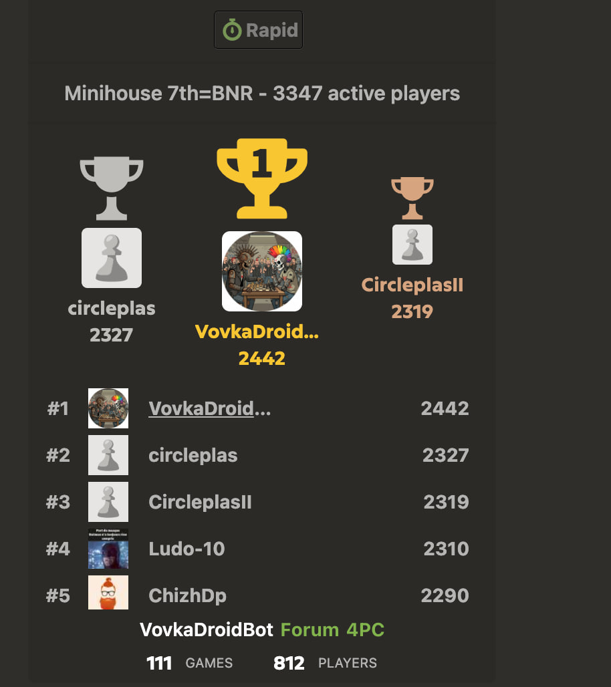
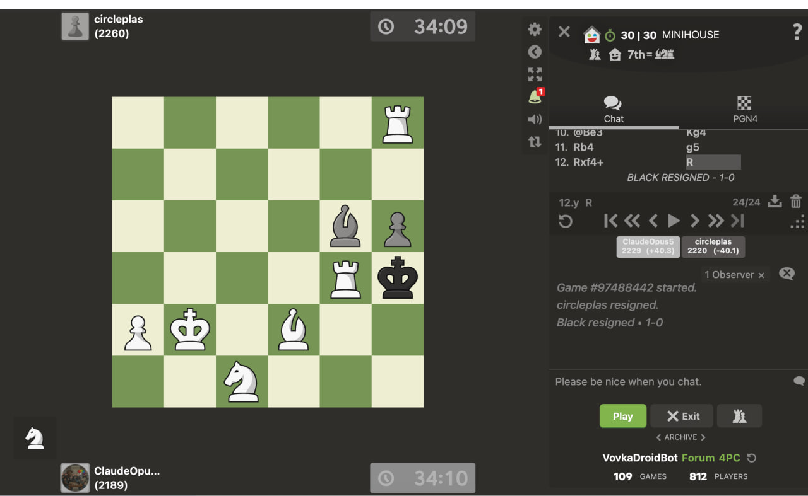

<div align="center">

# ♟️ MiniChess

**A Rust-powered 6×6 Crazyhouse chess engine that reached #1 in the world 🏆**

*Alpha-beta search · PyO3 bindings · Self-play training · Chess.com bot*

[](engine_rs/)
[](https://pyo3.rs)
[]()

<br>



*☝️ Yes, that's #1 on Chess.com minihouse leaderboard*

</div>

---

> 🤯 **Crazyhouse** — captured pieces go to your "hand" and can be dropped back onto the board on any empty square. This engine plays a 6×6 variant ("minihouse").

## 🏆 Results

The bot plays on Chess.com in the **minihouse** variant and has reached the **#1 spot on the global leaderboard**:

<div align="center">


*Beating the former top player 💪*
</div>

The engine trains overnight via self-play, improving its opening book and evaluation every day 📈

## 🦀 Engine Highlights

The core engine is written in **Rust** (~3 300 LOC) and exposed to Python via [PyO3](https://pyo3.rs):

| Module | LOC | What it does |
|--------|-----|--------------|
| [`search.rs`](engine_rs/src/search.rs) | 1 011 | Parallel alpha-beta with PVS, LMR, null-move pruning, aspiration windows |
| [`gamestate.rs`](engine_rs/src/gamestate.rs) | 755 | Full move generation for 6×6 Crazyhouse (incl. drops) |
| [`eval.rs`](engine_rs/src/eval.rs) | 440 | Crazyhouse-tuned evaluation (material, king safety, drops) |
| [`types.rs`](engine_rs/src/types.rs) | 331 | Board representation and core types |
| [`cache.rs`](engine_rs/src/cache.rs) | 96 | SQLite-backed transposition table (4M entries) |
| [`zobrist.rs`](engine_rs/src/zobrist.rs) | 74 | Position hashing |

### 🔍 Search Features

- 🌀 **Iterative deepening** (depth 1 → 10) with aspiration windows
- ⚡ **Parallel search** — root moves fanned out to worker threads via Rayon
- 🎯 **PVS + LMR** — Principal Variation Search with Late Move Reduction
- 💥 **Quiescence search** — captures, promotions, and tactical drops near enemy king
- 🚫 **Null-move pruning** — automatically disabled when opponent holds pieces in hand
- 💾 **Transposition table** — Zobrist hashing, 4M entries, persisted to SQLite across sessions

### ⚖️ Evaluation

| Factor | Details |
|--------|---------|
| Material | P=100 · N=320 · B=330 · R=500 · Q=900 · K=20 000 |
| Hand pieces | Valued 60–100 % higher than on-board (instant deployment) 🖐️ |
| King safety | Pawn shield +55/pawn, exposed king up to −390 penalty 🛡️ |
| Center control | +12 inner center, +6 extended center |
| Drop threats | Progressive bonus scaling with pieces in hand 📈 |

> Full writeup → [`docs/evaluation_strategy.md`](docs/evaluation_strategy.md)

## 🚀 Quick Start

### 🔧 Prerequisites

- **Rust** toolchain (`rustup`)
- Python 3.11+ (for GUI & bot)

### 🎮 Build & Run

```bash
git clone <repo-url> && cd MiniChess

# Build the Rust engine
cd engine_rs
pip install maturin
maturin develop --release
cd ..

# Install Python deps
python3 -m venv venv && source venv/bin/activate
pip install -r requirements.txt

# Play!
./play.sh
```

### 🧠 Self-Play Training

```bash
./train.sh          # Ctrl+C to stop gracefully
```

### 🤖 Chess.com Bot

```bash
cp .env.example .env   # add your credentials
pip install -r requirements.txt
python -m playwright install chromium

./bot_start.sh casual  # or: rated
./bot_stop.sh
./monitor_bot.sh
```

> ⚠️ Make sure you comply with chess.com's Terms of Service.

## 🏗️ Architecture

```
                    ┌──────────────────────────────┐
                    │   minichess_engine (Rust)     │
                    │                              │
  ai.py ──PyO3──▶  │  search.rs ◄── eval.rs       │
                    │      │           │            │
                    │  gamestate.rs  zobrist.rs     │
                    │      │                       │
                    │  cache.rs (SQLite)            │
                    └──────────────────────────────┘
                              ▲
      ┌───────────────────────┼────────────────────┐
      │                       │                    │
  main.py + gui.py      play_online.py       self_play.py
  (Pygame GUI)          (Chess.com bot)      (Training)
```

## 📂 Project Layout

```
engine_rs/              ← Rust engine (core)
  src/
    search.rs           — parallel alpha-beta + quiescence
    eval.rs             — position evaluation
    gamestate.rs        — move generation & board state
    types.rs            — core types & board representation
    cache.rs            — SQLite transposition table
    zobrist.rs          — position hashing
    lib.rs              — PyO3 module entry point

*.py                    ← Python layer (GUI, bot, training)
  ai.py                 — AI wrapper delegating to Rust
  gamestate.py          — game rules & state management
  gui.py                — Pygame board rendering
  main.py               — game loop entry point
  play_online.py        — chess.com browser bot
  config.py / pieces.py / utils.py

docs/                   ← Documentation
tests/                  ← Test suite
```

## 📖 Documentation

| Doc | Content |
|-----|---------|
| [Architecture](docs/ARCHITECTURE.md) | System design & component interactions |
| [Evaluation Strategy](docs/evaluation_strategy.md) | Detailed scoring heuristics |
| [Improvement Roadmap](docs/IMPROVEMENTS.md) | Planned enhancements |

## 📝 License

Private project.

---

<div align="center">

*Built with 🦀 Rust + 🐍 Python + ☕ lots of coffee*

</div>
